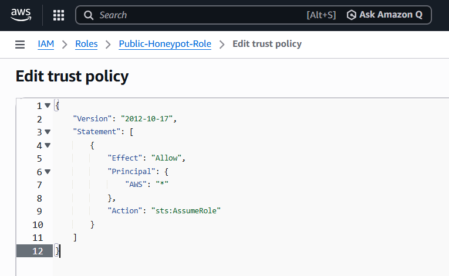
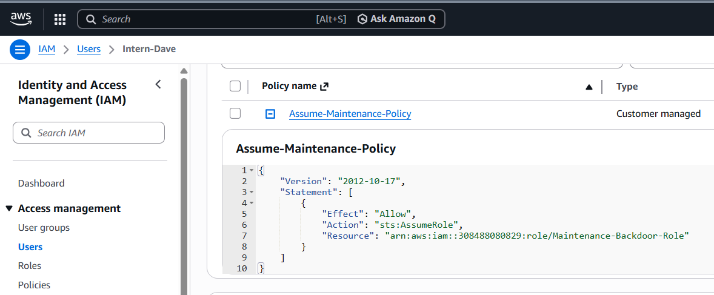
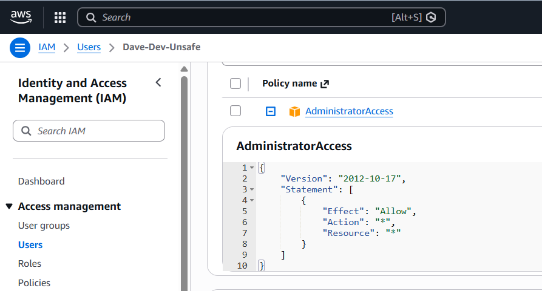
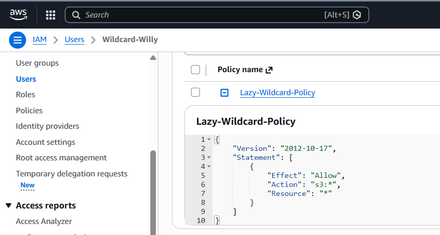
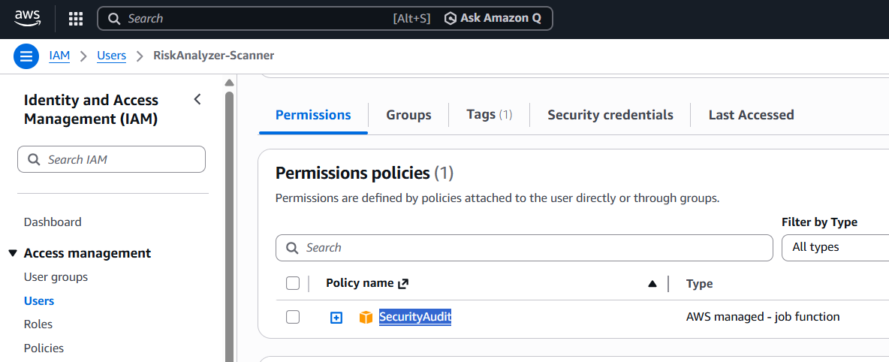

#  CloudLens: Proof of Concept & AWS Case Studies

This document provides a detailed walkthrough of the AWS environment used to validate the **CloudLens** risk engine. It demonstrates the "Truth in the Console" versus the "Intelligence in the Dashboard."

---

## 🔬 Case Study 1: The Public Entry Point
**Vulnerability:** Publicly Assumable Role  
**AWS Evidence:** A role named `Public-Honeypot-Role` was configured with a Trust Policy allowing `Principal: "*"`.

> **CloudLens Result:** The engine identifies the `*` wildcard in the JSON structure and flags this as a **CRITICAL** risk. In the Graph Explorer, this role is visually linked to a node called **"The Internet."**

---

## ⛓️ Case Study 2: Hidden Privilege Escalation
**Vulnerability:** Role Chaining / Lateral Movement  
**AWS Evidence:** A low-level user `Intern-Dave` is granted `sts:AssumeRole` permissions on a high-privilege maintenance role.

> **CloudLens Result:** While a manual auditor might miss this single line of JSON, CloudLens builds a relationship edge between the user and the role, identifying a valid attack path to Administrative power.

---

## 🔓 Case Study 3: The "Lazy" Administrator
**Vulnerability:** Full Admin Access & Security Hygiene  
**AWS Evidence:** User `Dave-Dev-Unsafe` has the managed `AdministratorAccess` policy attached directly, but **MFA is NOT enabled**.

> **CloudLens Result:** Our engine runs dual-logic checks. It flags the user for **Critical Excessive Permissions** and simultaneously generates a **High Security Hygiene** finding for the missing MFA.

---

## 🟠 Case Study 4: Broad Service Wildcards
**Vulnerability:** Over-permissive Resource Access  
**AWS Evidence:** User `Wildcard-Willy` has an inline policy allowing `s3:*` on all resources (`*`).

> **CloudLens Result:** CloudLens parses the `Action` and `Resource` fields. Because the action is a service wildcard (`s3:*`) rather than a specific action, it is categorized as a **HIGH** risk finding.

---

## 🛡️ Case Study 5: The Zero-Trust Scanner
**Security Model:** Least Privilege Execution  
**AWS Evidence:** The `RiskAnalyzer-Scanner` identity (used by this tool) is strictly limited to the AWS-managed **`SecurityAudit`** policy.

> **CloudLens Result:** This proves the tool's privacy model. It is 100% read-only and cannot modify, delete, or create any resources in the target environment.

---

## 📋 Target Environment Summary
The following identities were used to generate the 75/100 Risk Score seen in the demonstration:

---

*Return to [Main README.md](README.md)*
